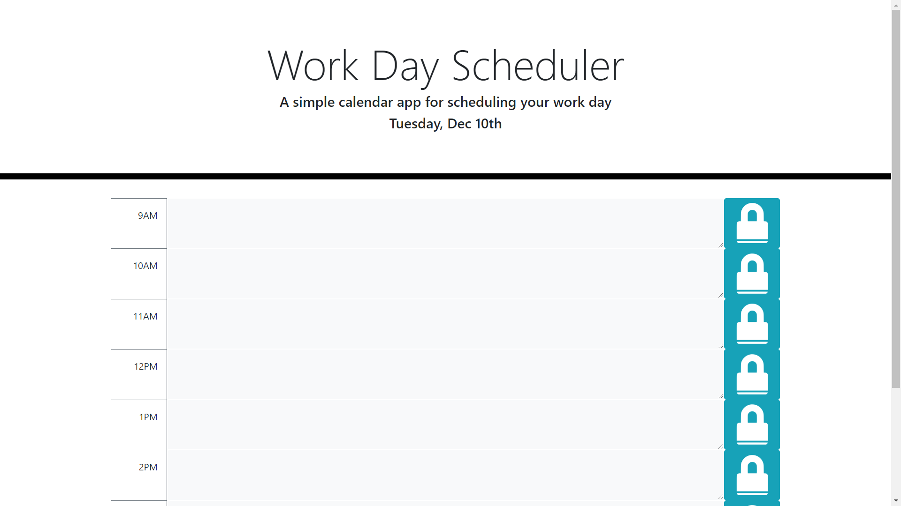
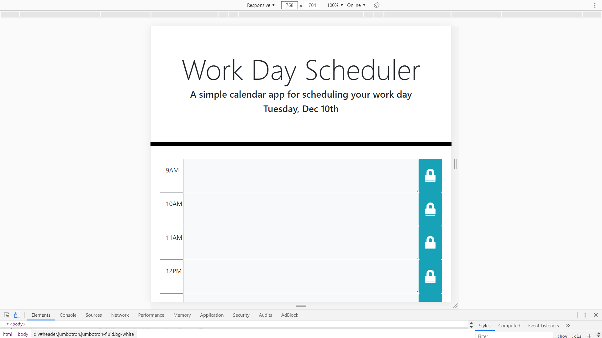
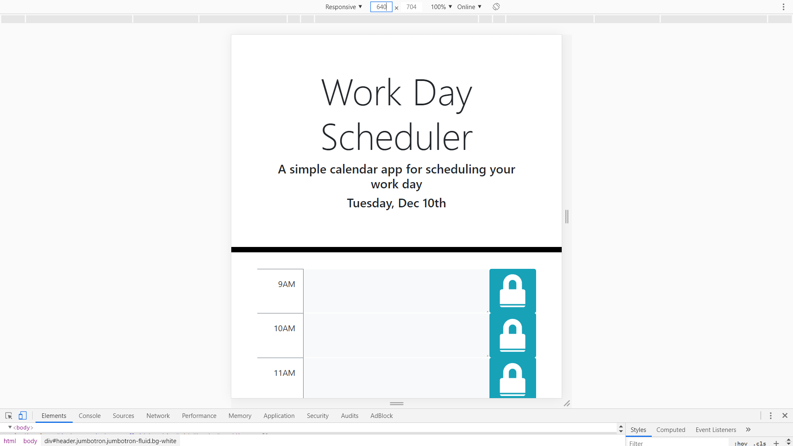
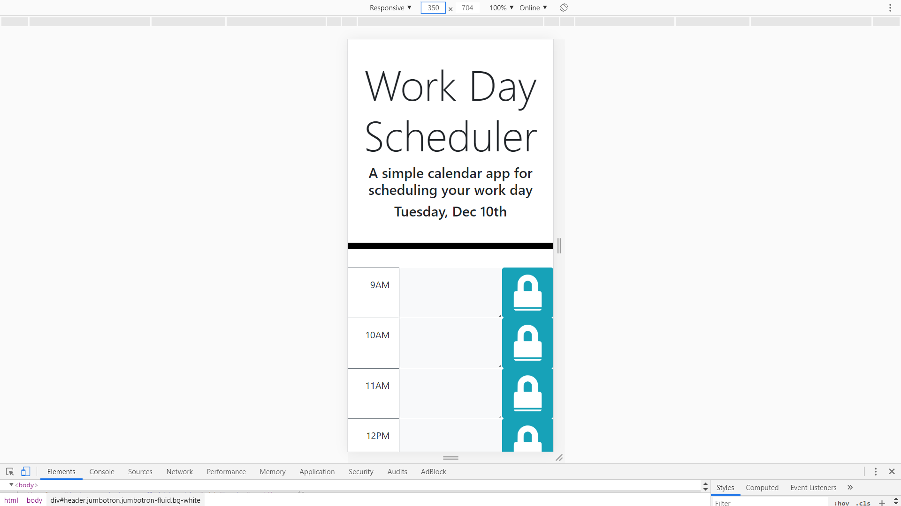

# Day Planner

## Description

This website is a day planner for a 9am-5pm work day. The current date is displayed on the header, and there is a row for every hour in the time interval form 9am to 5pm. Each row contains three columns: the time, a text area for inputing tasks, and a save button. The user inputs a tasks into the text area, and the clicking the save button will save the text area input to local storage. Additionally, the background color of each text area will change depending on the current time. Past times are displayed in gray, the current time is displayed in red, and future times are displayed in green.

## Technologies Used

* [HTML](https://developer.mozilla.org/en-US/docs/Web/HTML)
* [CSS](https://developer.mozilla.org/en-US/docs/Web/CSS)
* [Javascript](https://developer.mozilla.org/en-US/docs/Web/JavaScript)
* [jQuery](https://jquery.com/)
* [Bootstrap](https://getbootstrap.com/)
* [Git](https://git-scm.com/)
* [GitHub](https://github.com/)
* [VSCode](https://code.visualstudio.com/)

## Deployed Link

* [https://yjmiranda.github.io/day-planner/]

## Code Snipet

```
    if(parseInt(textArea.attr("data-time")) < parseInt(moment().format("H"))){
        textArea.addClass("bg-light");
    }
    if(parseInt(textArea.attr("data-time")) > parseInt(moment().format("H"))){
        textArea.addClass("bg-success text-white");
    }
    if(parseInt(textArea.attr("data-time")) === parseInt(moment().format("H"))){
        textArea.addClass("bg-danger text-white");
    }
```
This is portion of the script.js file shows how the background colors for the textareas are rendered. Using the moment.js library, the program is able to get the current time. In this case the it returns the current hour in military time. The use of military time makes the comparisons more simple. Each textarea has a "data-time" attribute with a value indicating the time the textarea is supposed to represent. The data-time is compared with the current time and the result provides the background color.

parseInt was used for more accurate comparisons since both values are strings.

## Screenshots

Screenshots at different widths.









## Author

**Yalí Miranda** 

* [Github](https://github.com/yjmiranda)